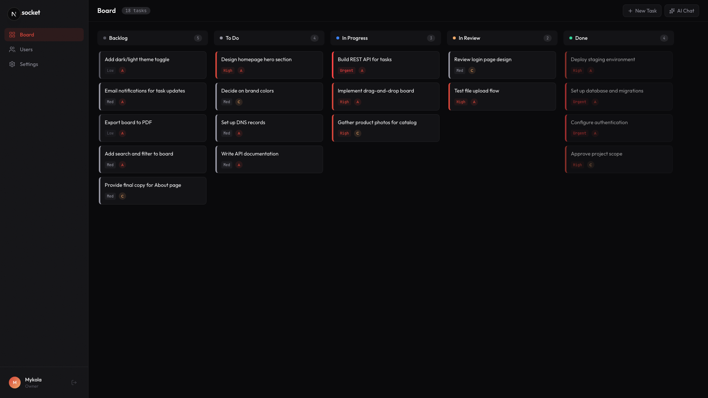
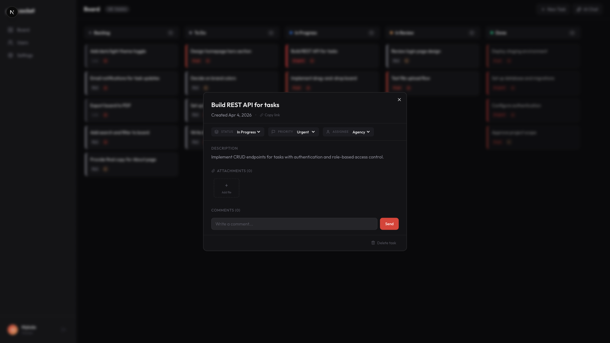
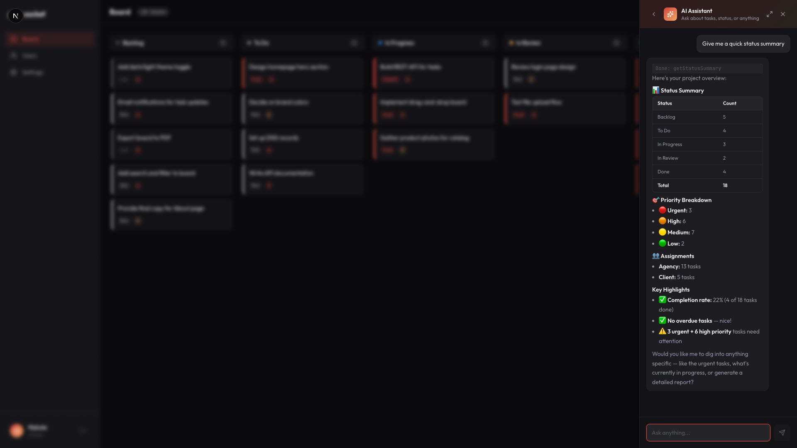

# plan.socket.agency

**Open-source kanban board with a built-in AI assistant.** Manage tasks, collaborate with clients, and let AI handle the busywork — creating tasks, generating reports, and answering questions about project progress.

Built for agencies and freelancers who need a simple, opinionated project board with clear owner/client boundaries.

[](LICENSE)
[](https://vercel.com/new/clone?repository-url=https://github.com/socket-agency/plan.socket.agency&env=DATABASE_URL,JWT_SECRET,ANTHROPIC_API_KEY,BLOB_READ_WRITE_TOKEN)



<details>
<summary>Task detail & AI chat</summary>





</details>

---

## Features

- **Kanban board** — drag-and-drop tasks across Backlog, To Do, In Progress, In Review, and Done
- **AI assistant** — ask questions, create/update tasks, generate reports — all through natural language
- **Role-based access** — owners get full control; clients can view the board, leave comments, and request tasks
- **MCP server** — connect external AI tools (Claude Code, Codex, OpenCode, etc.) to manage tasks programmatically
- **Email notifications** — real-time event emails and configurable daily activity digests
- **Persistent chat history** — conversations saved per user with auto-generated titles
- **Comments & file attachments** — collaborate directly on tasks with threaded comments and uploads
- **Task metadata** — priorities, assignees, reviewers, due dates with overdue tracking
- **Activity timeline** — full audit trail of every change on every task
- **Dark theme** — because it's 2026

### Owner vs Client

| | Owner | Client |
|---|:---:|:---:|
| View board | ✓ | ✓ |
| Create tasks | ✓ (any column) | ✓ (backlog only) |
| Edit / delete tasks | ✓ | own backlog tasks |
| Drag & drop | ✓ | — |
| Comments & attachments | ✓ | ✓ |
| AI: create / update / delete tasks | ✓ | — |
| AI: ask questions & view reports | ✓ | ✓ |
| Manage users | ✓ | — |

---

## Tech Stack

| Layer | Tech |
|-------|------|
| Framework | [Next.js 15](https://nextjs.org/) (App Router, React 19) |
| UI | [shadcn/ui](https://ui.shadcn.com/) + [Tailwind CSS v4](https://tailwindcss.com/) |
| Database | PostgreSQL ([Neon](https://neon.tech/)) + [Drizzle ORM](https://orm.drizzle.team/) |
| Auth | Password-based, [Argon2id](https://github.com/nicolo-ribaudo/tc39-proposal-hash-and-verify) hashing, JWT sessions |
| Drag & drop | [@dnd-kit](https://dndkit.com/) |
| AI | [Vercel AI SDK](https://sdk.vercel.ai/) + [Anthropic](https://www.anthropic.com/) (tool use) |
| MCP | [Model Context Protocol](https://modelcontextprotocol.io/) server for external AI integrations |
| Email | [Resend](https://resend.com/) + [React Email](https://react.email/) |
| File storage | [Vercel Blob](https://vercel.com/docs/storage/vercel-blob) |
| Runtime | [Bun](https://bun.sh/) |

---

## Getting Started

### Prerequisites

- [Bun](https://bun.sh/) (v1.0+)
- [just](https://github.com/casey/just) (`brew install just`) — optional but recommended
- A PostgreSQL database ([Neon](https://neon.tech/) free tier works)
- An LLM API key (defaults to [Anthropic](https://console.anthropic.com/))

### 1. Clone and install

```bash
git clone https://github.com/socket-agency/plan.socket.agency.git
cd plan.socket.agency
bun install
```

### 2. Configure environment

```bash
cp .env.example .env.local
```

| Variable | Required | Description |
|----------|:--------:|-------------|
| `DATABASE_URL` | ✓ | PostgreSQL connection string |
| `JWT_SECRET` | ✓ | Secret for signing JWTs (min 32 characters) |
| `ANTHROPIC_API_KEY` | ✓ | Anthropic API key for the AI assistant |
| `BLOB_READ_WRITE_TOKEN` | | Vercel Blob token (for file attachments) |
| `RESEND_API_KEY` | | [Resend](https://resend.com/) API key (for email notifications) |
| `NEXT_PUBLIC_APP_URL` | | Public URL of the app (used in emails) |
| `NOTIFICATION_FROM_EMAIL` | | Sender address for notification emails |

### 3. Run migrations

```bash
bunx drizzle-kit migrate
```

### 4. Seed the database (optional)

Creates sample users and tasks to get started quickly.

```bash
bun run src/db/seed.ts
```

Default credentials after seeding:

| Role | Email | Password |
|------|-------|----------|
| Owner | `admin@socket.agency` | `admin123` |
| Client | `client@example.com` | `client123` |

### 5. Start the dev server

```bash
bun dev
```

Open [http://localhost:3000](http://localhost:3000).

---

## Commands

With [just](https://github.com/casey/just) (auto-loads `.env.local`):

| Command | Description |
|---------|-------------|
| `just dev` | Start dev server |
| `just build` | Production build |
| `just lint` | Run ESLint |
| `just db-generate` | Generate migrations from schema changes |
| `just db-migrate` | Apply pending migrations |
| `just db-seed` | Seed database with sample data |
| `just db-studio` | Open Drizzle Studio (DB browser) |

<details>
<summary>Without <code>just</code></summary>

You'll need to load `.env.local` yourself for DB commands.

| Command | Description |
|---------|-------------|
| `bun dev` | Start dev server |
| `bun run build` | Production build |
| `bun run lint` | Run ESLint |
| `bunx drizzle-kit generate` | Generate migrations from schema changes |
| `bunx drizzle-kit migrate` | Apply pending migrations |
| `bun run src/db/seed.ts` | Seed database with sample data |
| `bunx drizzle-kit studio` | Open Drizzle Studio (DB browser) |

</details>

---

## Project Structure

```
src/
├── app/
│   ├── (app)/                    # Authenticated routes (kanban, settings, etc.)
│   │   └── _components/          # Board, columns, task cards, AI chat, nav
│   ├── api/
│   │   ├── auth/                 # Login, logout, session, API keys
│   │   ├── chat/                 # AI chat streaming endpoint
│   │   ├── conversations/        # Chat history management
│   │   ├── cron/                 # Scheduled jobs (daily digest)
│   │   ├── mcp/                  # MCP server endpoint
│   │   ├── notifications/        # Notification preferences
│   │   ├── tasks/                # Task CRUD, reorder, comments, attachments, events
│   │   └── users/                # User management
│   └── login/                    # Public login page
├── components/ui/                # shadcn/ui components
├── db/
│   ├── schema.ts                 # Drizzle schema (all tables & enums)
│   └── seed.ts                   # Sample data seeder
├── emails/                       # React Email templates
├── hooks/                        # Custom React hooks
└── lib/
    ├── ai/                       # System prompts & tool definitions
    ├── mcp/                      # MCP server, auth, and tool definitions
    ├── notifications/            # Email notification logic
    ├── auth.ts                   # JWT session management
    ├── api-auth.ts               # API route auth helpers
    └── permissions.ts            # Role-based permission checks
```

---

## MCP Integration

The app exposes a [Model Context Protocol](https://modelcontextprotocol.io/) server, allowing external AI tools to manage tasks programmatically.

### Setup

1. Go to **Settings > API Keys** in the app and generate a key
2. Add the MCP server to your client config:

```json
{
  "mcpServers": {
    "plan": {
      "type": "streamable-http",
      "url": "https://your-domain.com/api/mcp",
      "headers": {
        "Authorization": "Bearer sk_live_..."
      }
    }
  }
}
```

### Available tools

| Tool | Description |
|------|-------------|
| `list_tasks` | List all tasks (filterable by status, priority, assignee) |
| `get_task` | Get full task details |
| `create_task` | Create a new task |
| `update_task` | Update task fields |
| `delete_task` | Soft-delete a task |
| `get_task_comments` | List comments on a task |
| `add_comment` | Add a comment to a task |
| `get_task_attachments` | List file attachments |
| `get_attachment_file` | View an attachment inline |
| `get_board_summary` | Board-wide stats (counts, progress, overdue) |

Write operations require an API key with owner role.

---

## Email Notifications

Notifications are powered by [Resend](https://resend.com/) and [React Email](https://react.email/).

- **Event notifications** — instant emails when tasks are created, commented on, or updated
- **Activity digest** — daily summary of all project activity (runs at 9:00 UTC)

Each user can configure their preferences under **Settings > Notifications**.

To enable, set `RESEND_API_KEY` and `NOTIFICATION_FROM_EMAIL` in your environment.

---

## Deployment

### Vercel

The easiest option and what we currently use. It's a standard Next.js app, so Vercel detects everything automatically.

1. Import the repo in the Vercel dashboard
2. Add environment variables from `.env.example`
3. Deploy

Run migrations against your production database:

```bash
DATABASE_URL="your-prod-url" bunx drizzle-kit migrate
```

Or add to your build command: `bunx drizzle-kit migrate && next build`

### Self-hosting (VPS / Docker / bare metal)

The app is a standard Next.js project — it runs anywhere Node or Bun runs.

**1. Build the standalone output:**

```bash
bun install
bun run build
```

Next.js produces a `.next/standalone` directory with everything needed to run the server. Copy `.next/static` into `.next/standalone/.next/static` and `public` into `.next/standalone/public`:

```bash
cp -r .next/static .next/standalone/.next/static
cp -r public .next/standalone/public
```

> **Note:** You need to enable standalone output first. Add `output: "standalone"` to `next.config.ts`.

**2. Run the server:**

```bash
DATABASE_URL="postgres://..." \
JWT_SECRET="your-secret" \
ANTHROPIC_API_KEY="sk-ant-..." \
node .next/standalone/server.js
```

The server starts on port 3000 by default. Set `PORT` to change it.

**3. Database:**

Any PostgreSQL instance works — [Neon](https://neon.tech/), [Supabase](https://supabase.com/), a local `postgres` container, or a managed instance on your cloud provider. Run migrations before starting the server:

```bash
DATABASE_URL="your-prod-url" bunx drizzle-kit migrate
```

**4. File storage:**

File attachments use Vercel Blob by default. For self-hosted setups, you can either:
- Use Vercel Blob as a standalone service (works outside Vercel hosting)
- Swap the storage layer in `src/app/api/tasks/[id]/attachments/` to use S3, local disk, or another provider

**5. Reverse proxy:**

Put the app behind nginx, Caddy, or similar for SSL termination:

```nginx
server {
    server_name plan.example.com;

    location / {
        proxy_pass http://127.0.0.1:3000;
        proxy_set_header Host $host;
        proxy_set_header X-Real-IP $remote_addr;
        proxy_set_header X-Forwarded-For $proxy_add_x_forwarded_for;
        proxy_set_header X-Forwarded-Proto $scheme;
    }
}
```

Use a process manager like `pm2` or `systemd` to keep the server running.

---

## Contributing

Contributions are welcome! Here's how to get started:

1. Fork the repository
2. Create a feature branch (`git checkout -b feature/your-feature`)
3. Make your changes
4. Run linting (`just lint` or `bun run lint`)
5. Commit with a descriptive message
6. Open a pull request

Please open an issue first for large changes to discuss the approach.

---

## Roadmap

See [TODO.md](TODO.md) for the full list of planned features and improvements, including:

- Magic link / OAuth authentication
- Multi-tenancy and project support
- Calendar and timeline views
- Webhook integrations (Slack, Discord)
- Mobile-responsive improvements

---

## License

[MIT](LICENSE) — use it, fork it, ship it.
